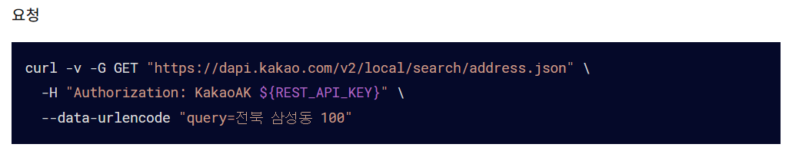
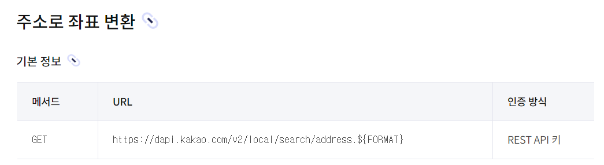
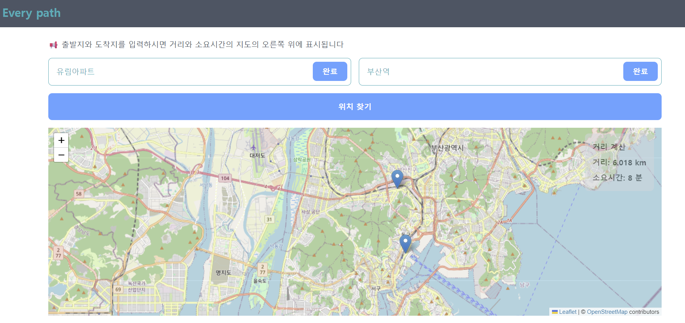
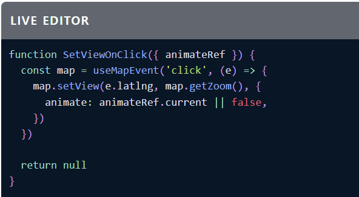

# Every path 

## Leaflet을 이용한 지도 웹 어플리케이션 만들어보기

### ❓ Why

>해커톤에서 지도를 이용하여 프로젝트를 진행하였지만 그 과정에서 지도를 다루는 API와 개발은 내가 직접 하지 못하였습니다. 그래서 `내가 한 번 해보면 어떨까?`라는 생각을 통하여 이 아이디어를 내게 되었습니다.

### 🤔 선택한 라이브러리

react와 호환되는 React-Leaflet을 이용

React Leaflet docs : https://react-leaflet.js.org/

### 📝 구현 목표
- [X] 출발지와 도착지를 입력하면 마커로 표시
- [X] 출발지와 도착지를 검색하여 길 찾기 API를 이용하여 거리 표시

### KaKao API

REST API DOCS : https://developers.kakao.com/docs/latest/ko/local/dev-guide

    한국 위치 정보에 강점을 보이기에 사용해야 함
        - 지도의 경우, 정확성이 매우 중요함
    REST API 사용한 이유
        - 맵 자체는 React-Leaflet을 사용하기에 SDK 설치를 하지 않고 API만 이용하기 위해 선택    

카카오 API의 경우 REST API 키를 발급 받고 `KakaoAK ${my_rest_api_token_key}`를 헤더에 추가해야 하며 이는 로컬 API와 길찾기 API 모두 동일한 인증 헤더를 추가해야 하였습니다. 

 

또한, 검색한 위치 정보를 좌표로 변환해야 Leaflet의 마커로 체크 할 수 있는데 이를 위하여 로컬 API를 추가적으로 사용하여 위 검색한 장소에 따른 위경도 좌표를 얻을 수 있었습니다.



출처 : https://developers.kakao.com/docs/latest/ko/local/dev-guide

응답에서 오는 데이터들을 JSON 형태로 확인할 수 있었으며 JSON 형태의 응답구조를 통해 필요한 데이터들을 추출하여 렌더링할 수 있었습니다.



### React-Leaflet

Leaflet 라이브러리를 통해 아래의 이미지와 같이 맵의 확대 비율과 위치를 동적으로 조정할 수 있도록 지원하여 검색어에 입력된 지점으로 위치를 이동과 거리에 따른 확대율 조정을 할 수 있었습니다.



출처: https://react-leaflet.js.org/docs/example-animated-panning/


```js
/* 지정된 위치에 따라 중점을 이동 */
const ChangeCenter = ({center, zoom}) => {
    const map = useMap();

    useEffect(() => {
        if (center) { 
            map.setView(center, zoom);
        }
    }, [center, zoom, map]);

    return null;
}
```

### 😢 아쉬웠던 점 
- 외부 API 사용이 미숙하여 좀 더 많은 기능을 추가하지 못하였습니다.
- 좌표 정보가 없는 위치 정보가 있었어 검색이 불가능한 엣지 케이스가 있었습니다.
- 좌표 정보에 따라 맞는 위치 정보가 다수이지만 해운대 등과 같은 위치는 잘못된 위경도 좌표를 반환하고 있었어서 예상과 다른 곳에 마커가 찍히는 예외 상황이 발생하였습니다.

### 😊 얻을 수 있었던 점
> DOCS만을 이용해서도 기초적인 라이브러리의 사용과 카카오 API 사용에 쉽게 접근할 수 있었으며 외부 API를 사용해서 개발하는 경험이 처음이었는데 짧지만 개발을 하면서 API와 라이브러리의 호환성, 사용하는 컨테이너에 따라 API의 활용도가 달라진다는 것을 느끼게 되는 계기가 되었습니다. 
